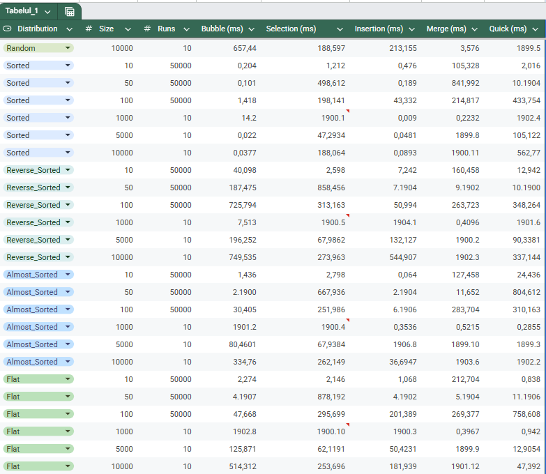

# Studiu-Comparativ-al-Algoriitmilor-de-Sortare
Acest proiect este o aplicație de performanță care compară 5 algoritmi clasici de sortare pe diverse seturi de date. Scopul este de a demonstra diferența de eficiență între complexitățile $O(n^2)$ și $O(n \log n)$.

Algoritmi Implementați 
-
- Bubble Sort (O(n^2))
- Selection Sort (O(n^2))
- Insertion Sort (O(n^2))
- Merge Sort (O(n \log n))
- Quick Sort (O(n \log n))

**Structura Proiectului**
Codul este organizat modular pentru a fi ușor de întreținut:
-
- main.cpp: Interfața cu utilizatorul și meniul principal.
- Algorithm.h: Implementările algoritmilor de sortare.
- Generators.h: Logica pentru generarea datelor (Random, Sorted, Reverse, Almost Sorted, Flat).
- Benchmark.h: Motorul de testare care măsoară timpul și exportă datele în format .csv

  ### 📊 Rezultate Benchmark (Mărime: 10.000 elemente)

Toate valorile sunt exprimate în **milisecunde (ms)**.

| Distribuție | Bubble Sort | Selection Sort | Insertion Sort | Merge Sort | Quick Sort |
| :--- | :---: | :---: | :---: | :---: | :---: |
| **Random** | 657,44 | 188,59 | 213,15 | 3,57 | 1,89 |
| **Sorted** | 0,03 | 188,06 | 0,08 | 1,90 | 0,56 |
| **Reverse** | 749,53 | 273,96 | 544,90 | 1,90 | 0,33 |
| **Almost Sorted** | 334,76 | 262,14 | 36,69 | 1,90 | 1,90 |
| **Flat** | 514,31 | 253,69 | 181,93 | 1,90 | 47,39 |

**Anomalia 1: Quick Sort pe date "Flat" (egale)**
-

Când toate elementele sunt egale, algoritmul tău Quick Sort nu mai reușește să împartă lista în două jumătăți egale. Deoarece toate numerele sunt egale cu Pivotul, el pune 0 elemente în stânga și restul de $n-1$ elemente în dreapta. Asta forțează algoritmul să facă pași minusculi, degradându-se teoretic într-o complexitate de $O(n^2)$.
Cum se reproduce: Generează o listă de 10.000 de elemente de "1" și rulează codul cu Quick Sort.

**Anomalia 2: Insertion Sort pe date "Flat"**
-
Motivul pentru care rezultatele practice nu coincid aici cu teoria ține strict de detaliile de implementare a codului, mai exact de operatorul logic folosit în bucla de căutare.

În mod normal, algoritmul mută elementele spre dreapta doar cât timp numărul curent este strict mai mic decât cel verificat. Însă, dacă implementarea folosește operatorul mai mare sau egal (>=) în condiția buclei while în loc de strict mai mare (>), algoritmul este păcălit. El vede două numere identice (de exemplu, 5 și 5) și decide să le schimbe locul între ele.Astfel, deși șirul rămâne neschimbat vizual, programul efectuează $O(n^2)$ operații de mutare inutile în memorie pentru fiecare număr în parte. Această muncă în zadar se traduce în acele 181 de milisecunde înregistrate de cronometru.
